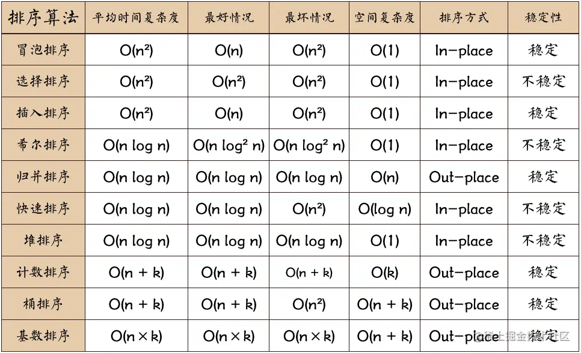

常见排序分类：

排序动画 https://leetcode.cn/problems/sort-an-array/solutions/1414238/912-pai-xu-shu-zu-by-duanyutian-j7c3/

#### 冒泡排序

时间复杂度：`O(n^2)`

空间复杂度：`O(1)`

**简单、稳定 但效率低**

实现：不断迭代比较相邻的两个项，如果 A > B 交换两者位置，每次迭代都可以将最大的项"浮"到末尾。

#### 快速排序

时间复杂度：平均 O(nlogN)、最好 O(nlogN)、最坏 O(n²)

空间复杂度：O(nlogN)

In-place 内排序

不稳定

实现：

从数组中选出一个基准值，遍历数组得到三部分（1.比基准小的子数组 2.基准值 3.比基准大的子数组），对子数组再次进行遍历，最终得到排序后的数组。

最差情况，如果每次都用最左边的值或者最右边的值那么效率等同于冒泡排序。

#### 堆排序

时间复杂度：平均 O(nlogN)、最好 O(nlogN)、最坏 O(nlogN)

空间复杂度：O(1)

In-place 内排序

不稳定

#### 插入排序

时间复杂度：平均 O(n²)、最好 O(n)、最坏 O(n²)

空间复杂度：O(1)

In-place 内排序

稳定

#### 希尔排序

时间复杂度：平均 O(nlogN)、最好 O(nlog²N)、最坏 O(n²)

空间复杂度：O(1)

In-place 内排序

不稳定
